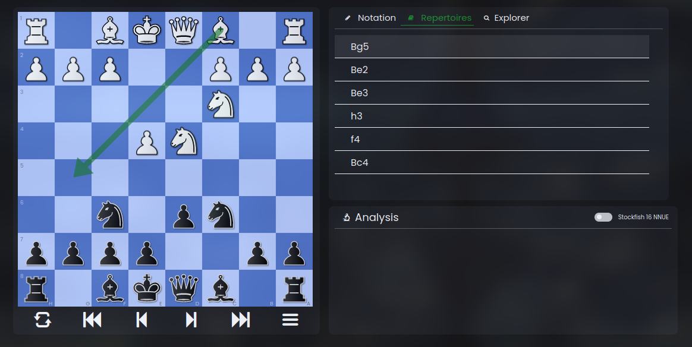

# ChessBASED

A comprehensive chess analysis software, aiming to provide a free
open-source alternative of
[chessbase](https://shop.chessbase.com/en/products/chessbase_17_premium_package_edition_2024) - the world's most prominent chess software -
with a more modern UI and improved user experience.

Built with HTML, CSS, and vanilla javascript.

## Features

### 1. Opening Explorer

### 2. Chess Engine Integration (Stockfish)

### 3. Repertoire Manager

## Note

This project is abandoned and I'm working on a complete rewrite for it using React and Django.
